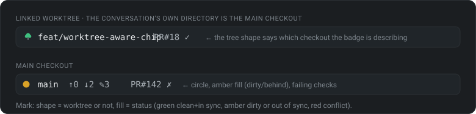
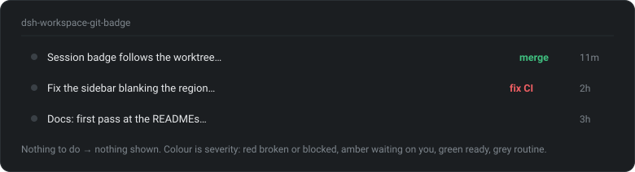

# dsh-git-badge

Git status badges for [DeepSeek Harness](https://github.com/deepseek-ai/deepseek-harness)

[](https://github.com/Kevin-McIsaac/dsh-workspace-git-badge/actions/workflows/test.yml)

## Why 

Most agent workflow failures happen quietly: branches drift, uncommitted files are left behind, 
and approved PRs or failed builds sit unnoticed. This plugin brings repository 
awareness directly into your workflow:

1. **At-a-glance session status**: branch, file counts and PR/CI state on the input box. When the session is working in a linked `git worktree`, the badge follows that tree rather than the main checkout.



2. **Actionable session overview**: pinpoints the session requiring attention (`merge`, `fix CI`, `resolve`) without a context switch.



Both are updated within seconds of any commit, checkout, stage or file
edit — including inside a linked worktree.


## Install

```bash
dsh plugin --profile web add dsh-git-badge
```

Then restart the web process and refresh the browser. This activates the input
chip on any install.

Sidebar session-row tokens need a seam the workspace browser does not declare
upstream yet (discussion
[#5092](https://github.com/deepseek-ai/deepseek-harness/discussions/5092)). The
patcher **ships inside the package** — no clone needed:

```bash
npx dsh-git-badge apply     # patch the installed DSH in place, then restart dsh web
npx dsh-git-badge status    # patched / out of date / patchable / upstream-landed / drift
npx dsh-git-badge revert    # restore the bytes as found before patching
```

(If you have this repo cloned, `seam/apply.sh` runs the same tool.)

Notes:

- The patch lives in `node_modules`, so a DSH reinstall/update reverts it —
  re-run the patcher afterwards.
- The patch is **anchor-based** (`seam/anchors.js`): it patches the installed
  file in place and **refuses to write anything** unless every anchor block is
  found exactly once — it never blind-overwrites an update. A DSH release only
  needs work from you if it moved one of the anchored code blocks; `status`
  names the anchor that moved.
- Once upstream ships the seam itself, `apply` becomes a no-op and the
  npm-installed plugin picks it up with no changes on your side.

Details, safety rails and the upstream proposal are in [`SEAM.md`](SEAM.md) /
[`PR.md`](PR.md).

## Testing

See [`TESTING.md`](TESTING.md) — clean-profile boot (customer simulation), the
seam apply/revert procedure, and the gotchas list. `cd dsh-git-badge && npm test`
runs the whole suite (parser, real temp repositories, resolution, SSE, the
watcher, every `gh` degradation path and the rendered surfaces) with no DSH, no
network and no restart.

## Requirements

- Node.js ≥ 20, `git` on PATH
- DSH with the `web` profile (any install)
- `gh` on PATH, authenticated, for the PR/CI token and the row's `merge`/`review`
  actions — otherwise those are silently absent and everything else still works

## License

[MIT](LICENSE)
