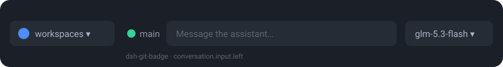

# dsh-git-badge

Git status badges for [DeepSeek Harness](https://github.com/deepseek-ai/deepseek-harness) workspaces — Claude Code statusline style:

```
the_paragliding_app           | 🟡 main ↑0 ↓2 ✎3
paragliding-site-federation   | 🟢 main
```

## What you get

- **Input-row chip** (works on every install, no patching): compact `🟢 main` next to the access picker, showing the git state of the workspace the current conversation is attached to:

  

- **Sidebar row badges** (full functionality — requires applying the [seam patch](#sidebar-row-badges-need-the-seam) below, which is a two-command local step): emoji (🟢 clean / 🟡 dirty), branch, `↑n`/`↓n` unpushed/unpulled commit counts, and `✎n` uncommitted files. On a dirty worktree both sync counts show including zeros (`↑0 ↓2 ✎3`) so every number is positionally attributable; clean workspaces stay quiet.

- **Event-driven freshness**: no polling. Each workspace's working tree is watched (`fs.watch`, recursive, 200 ms debounce) and updates push over SSE — badges flip within ~1 second of any commit, checkout, stage, or file edit. A 60s poll backs the SSE stream up in case it dies silently.

## Install

```bash
dsh plugin --profile web add dsh-git-badge
```

Then restart the web process and refresh the browser.

### Sidebar row badges need the seam

The input chip works everywhere. The sidebar row badge additionally requires
the `sidebar.workspaces.row` slot seam in
`@deepseek-ai/dsh-client-ui-workspace` — a 32-line additive patch proposed
upstream (discussion [#5092](https://github.com/deepseek-ai/deepseek-harness/discussions/5092)).
Until it lands, the plugin detects its absence at boot and logs which
surfaces are active to the browser console:

```
[dsh-git-badge] surfaces: input chip = on; sidebar rows = off (seam absent — sidebar badges need the sidebar.workspaces.row seam)
```

#### Quick path: apply the local patch

From a clone of this repo:

```bash
./apply.sh apply     # patch the installed DSH (hash-guarded), then restart dsh web
./apply.sh revert    # restore pristine at any time
```

Notes:

- The patch lives in `node_modules`, so a DSH reinstall/update reverts it —
  re-run `./apply.sh apply` afterwards.
- The hash-guard **refuses** to patch if the installed file doesn't match the
  pinned upstream build (it never blind-overwrites an update). Rebuild the
  patch with `make-patch.sh` + `stamp-hash.sh` after a DSH release changes
  the file.
- Once upstream ships the seam itself, `apply` becomes a no-op and the
  npm-installed plugin picks it up with no changes on your side.

Details, safety rails, and the upstream proposal are in
[`SEAM.md`](SEAM.md) / [`PR.md`](PR.md).

## Requirements

- Node.js ≥ 20, `git` on PATH
- DSH with the `web` profile (any install)

## License

[MIT](LICENSE)
